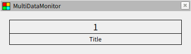
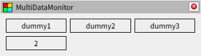
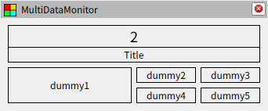

# ウィジェットについて

## ウィジェットの種類

ウィジェットには表示ウィジェットと配置ウィジェットの２種類があります。表示ウィジェットは前章の `Simple` のようにストリームからデータを受け取って表示するものですが、配置ウィジェットはストリームではなく他のウィジェットを `items` として受け取って配置を行います。このとき、ウィジェットの接続関係は木構造になっている必要があり、パネルには木構造の根となるオブジェトが自動的に選択されます。

## 表示ウィジェット

表示ウィジェットの例として `Titled` を紹介します。再び RViz を開いて以下の[ファイル](../../../examples/tutorials/02/titled.yaml)を読み込んでください。動作確認用のノードも先程と同じように起動します。このウィジェットはデータの下にタイトルを表示するデザインになっています。

```txt
package://multi_data_monitor/examples/tutorials/02/titled.yaml
```



## 配置ウィジェット

配置ウィジェットからは `Matrix` を紹介します。再び RViz を開いて以下の[ファイル](../../../examples/tutorials/02/matrix1.yaml)を読み込んでください。動作確認用のノードも先程と同じように起動します。このウィジェットは他のウィジェットを行列状に並べることができます。

```txt
package://multi_data_monitor/examples/tutorials/02/matrix1.yaml
```



また、`Matrix` 自身もウィジェットであるため、入れ子して以下の[ファイル](../../../examples/tutorials/02/matrix2.yaml)のような複雑なレイアウトを作成することも可能です。

```txt
package://multi_data_monitor/examples/tutorials/02/matrix2.yaml
```


