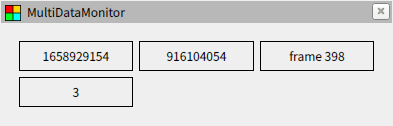

# データの表示

## ウィジェットの種類

ウィジェットより様々な形式でデータを表示できます。再び RViz を開いて [package://multi_data_monitor/tutorials/02/display2.yaml](display2.yaml) と入力してください。動作確認用のノードも先程と同じように起動します。このファイルでは multi_data_monitor::Title というウィジェットが使われており、データの下にタイトルを表示するデザインになっています。


また、他のウィジェットを受け取って配置するウィジェットも存在しています。これらのウィジェットにより、複数のデータを並べて表示することができます。同様に [package://multi_data_monitor/tutorials/02/display3.yaml](display3.yaml) を表示してみてください。これに使われている multi_data_monitor::Matrix ウィジェットは `input` がなく `children` に並べたいウィジェットを指定します。

```yaml
{ class: <plugin>, children: [<widget>, <widget>, ...] }
```



## ウィジェットの分割定義

今度は [package://multi_data_monitor/tutorials/02/display4.yaml](display4.yaml) を表示してみてください。先程と同じレイアウトでデータが表示されていますがコンフィグファイルの記述は異なっています。

```yaml
widgets:
  root:
    class: multi_data_monitor::Matrix
    cols: 3
    rows: 2
    children:
      - class: multi_data_monitor::Simple
        input: { model: topic, name: /test/header, data: stamp.sec, type: std_msgs/msg/Header }
      - class: multi_data_monitor::Simple
        input: { model: topic, name: /test/header, data: stamp.nanosec, type: std_msgs/msg/Header }
      - class: multi_data_monitor::Simple
        input: { model: topic, name: /test/header, data: frame_id, type: std_msgs/msg/Header }
      - class: multi_data_monitor::Simple
        input: { model: topic, name: /test/uint32, data: data, type: std_msgs/msg/UInt32 }
```

ウィジェットには `root` 以外の好きな名前をつけることができ `widgets` の直下に任意の名前を付けてウィジェットを定義できます。名前を付けたウィジェットは `children` など本来ウィジェットを指定する場所にて、直接オブジェクトを設定する代わりに付けた名前の文字列を使用することができます。

```yaml
widgets:
  root:
    class: multi_data_monitor::Matrix
    cols: 3
    rows: 2
    children:
      - view1
      - view2
      - view3
      - view4

  view1:
    class: multi_data_monitor::Simple
    input: { model: topic, name: /test/header, data: stamp.sec, type: std_msgs/msg/Header }

  view2:
    class: multi_data_monitor::Simple
    input: { model: topic, name: /test/header, data: stamp.nanosec, type: std_msgs/msg/Header }

  view3:
    class: multi_data_monitor::Simple
    input: { model: topic, name: /test/header, data: frame_id, type: std_msgs/msg/Header }

  view4:
    class: multi_data_monitor::Simple
    input: { model: topic, name: /test/uint32, data: data, type: std_msgs/msg/UInt32 }
```
