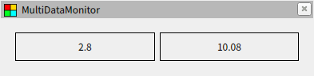
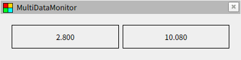
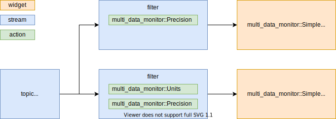

# データの加工

## データのフィルター処理

例えば単位が m/s のデータを km/h で表示したいことがあります。このディレクトリにある [process1.yaml](process1.yaml) を読み込むと、トピックで指定したデータが左側にはそのまま m/s で表示され、右側には km/h に変換した結果が表示されます。



これを実現しているのがフィルターで、以下のように`input` で指定したストリームのデータを任意のルールに従って変換します。フィルターもトピックと同じくストリームなので、ウィジェットの `input` に指定すれば変換した結果を画面に表示できます。

```yaml
{ model: filter, input: <stream>, rules: [<action1>, <action2>, ...] }
```

変換のルールはアクションを使って指定します。今回は multi_data_monitor::Units を使って単位の変換を行っていて、このアクションはパラメータに `type: mps_to_kph` を指定すると m/s から km/h への変換だと解釈します。

```yaml
{ class: <plugin>, ... <optional parameters> }
```

これらを全てまとめるとこのようになります。上記の process1.yaml ではトピックのデータを複数の入力で使えるようにストリームに名前を付けて扱っています。ストリームはコンフィグファイルの直下に `streams` というキーを作成し、その下に `widgets` と同じく任意の名前でオブジェクトを作成できます。

```yaml
class: multi_data_monitor::Simple
input:
  model: filter
  input: { model: topic, name: /test/double, data: data, type: std_msgs/msg/Float64 }
  rules:
    - { class: multi_data_monitor::Units, type: mps_to_kph }
```

## アクションの指定

フィルターには複数のアクションを設定可能で、指定した順番で適用されます。これを用いて [process2.yaml](process2.yaml) では km/h に変換した結果をフォーマットしています。



このコンフィグファイルにおけるデータの流れを図に示すと以下のようになります。データを複数の入力に分岐させない限り、フィルターに複数のアクションをまとめた方が簡潔に記述できます。


