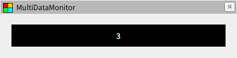
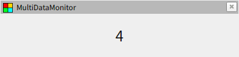
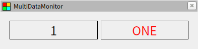
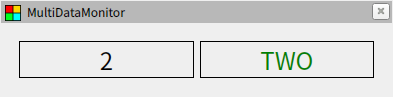
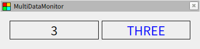
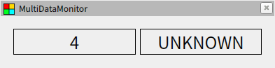

# スタイルシート

## スタイルの指定

スタイルの指定には Qt Style Sheets がそのまま使われています。コンフィグファイルの `stylesheets` は配列になっており、各要素で以下のようにスタイルシートのパスを指定します。特定のウィジェットにのみスタイルを反映したい場合は `target` にウィジェットの名前を記載してください。省略した場合は全てのウィジェットに適用されます。複数の要素で同じウィジェットを指定した場合、ファイルの内容を結合して適用します。

```yaml
{ path: <path>, target: <plugin> }
```

サンプルとして以下のファイルを用意しました。スタイルシートの文法については Qt のドキュメントを参照してください。また、対象とするウィジェットの構成に合わせてクラスセレクタを使用する場合、各ウィジェットの詳細を参照して使用されている Qt のクラス情報を確認してください。

- [style1.yaml](style1.yaml) / [style1.css](style1.css)

  

- [style2.yaml](style2.yaml) / [style2.css](style2.css)

  

- [style3.yaml](style3.yaml) / [style3.css](style3.css)

  

## 属性セレクター

スタイルシートの記述で以下のように属性セレクターを指定すると、データが特定の条件を満たした時のみスタイルを適用することができます。以前のストリームの説明では実体として YAML データが流れていると解説しましたが、実際には YAML データに加えて属性データも流れており、この属性の値に従ってスタイルが適用されます。

```css
* [name="value"] {
  color: red;
}
```

アクションの中には属性データを変更するものがあります。ここでは `multi_data_monitor::Switch` を使って属性を設定します。このアクションを使うと、データが指定した値と一致した時に値と属性をぞれぞれ書き換えることができます。まずは以下のように複数のスタイルを用意し、属性の `test` の値によって文字色が変わるようにしておきます。

```css
* [test="one"]   { color: red;   }
* [test="two"]   { color: green; }
* [test="three"] { color: blue;  }
```

続いてアクションを使って属性を設定します。今回は値が 1〜3 の時に表示を英語に置き換え、先ほと設定した属性が適用されるようにしました。値が一致しないときには `default` の設定が適用されるので属性は空になりスタイルがクリアされます。

```yaml
class: multi_data_monitor::Switch
default: { value: UNKNOWN, attrs: { test: "" } }
mapping:
  1: { value: ONE, attrs: { test: one } }
  2: { value: TWO, attrs: { test: two } }
  3: { value: THREE, attrs: { test: three } }
```

サンプルファイル ([style4.yaml](style4.yaml) / [style4.css](style4.css)) ではアクションの効果が分かりやすいように元の値と並べて表示しています。





