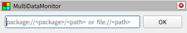

# 基本操作

## 初期設定

RViz のメニューからパネルを追加すると以下のようなウィジェットが追加されます。フォームにコンフィグファイルのパスを入力して OK ボタンを押すと設定が読み込まれて表示が切り替わります。エラーが発生した場合は詳細が表示されます。

設定ファイルのパスは以下のフォーマットで指定できます。パッケージフォーマットの場合は最初の階層を ROS パッケージのパスに置き換えます。ファイルフォーマットで絶対パスを指定する場合はスラッシュが三つ連続することに注意してください。

| Format                                 | Example                                         |
| -------------------------------------- | ----------------------------------------------- |
| package://&lt;package&gt;/&lt;path&gt; | package://multi_data_monitor/config/sample.yaml |
| file://&lt;path&gt;                    | file:///home/user-name/config/sample.yaml       |

## キー操作

パネルでは以下のキー操作がサポートされてます。

| Command            | Description                                                              |
| ------------------ | ------------------------------------------------------------------------ |
| Ctrl + left click  | 初期設定画面の表示状態を切り替えます。現在の画面は継続して表示されます。 |
| Shift + left click | タイトルバーの表示状態を切り替えます。                                   |
