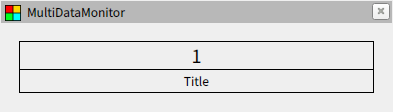

# データの表示

## コンフィグファイルの読み込み

まずは最も簡単なサンプルを表示させてみましょう。RViz にパネルを追加して package://multi_data_monitor/tutorials/02/display1.yaml と入力します。また、新しく端末を開いて multi data monitor のワークスペースに移動し、以下のコマンドを実行します。

```bash
source install/setup.bash
ros2 run multi_data_monitor tutorial
```

このノードは動作の確認用に 0 から 4 までカウントするトピックを流しています。先ほど開いた Rviz のパネルではこのデータを表示するように設定しているため、以下のようにトピックのデータが表示されます。


## コンフィグファイルの構成

先ほと使用したコンフィグファイルは以下のようになっています。まずはじめにバージョン情報を `version` で指定します。これはドットで区切られた２つの整数からなる文字列で、コンフィグファイルの互換性を確認するために使用されます。次にスタイルを `stylesheets` で設定していますが、これは別の章で説明するので詳細は省きます。簡単に触れておくと枠線やフォントサイズなどの設定が入っています。最も重要なのは `widgets` 以下で、トピックの指定や表示に関する設定を行っています。

```yaml
version: 1.0

stylesheets:
  - { path: package://multi_data_monitor/css/plugins/simple.css, target: multi_data_monitor::Simple }

widgets:
  root:
    class: multi_data_monitor::Simple
    input: { model: topic, name: /test/uint32, data: data, type: std_msgs/msg/UInt32 }
```

基本的な仕組みとして `widgets` の直下にある `root` という名前は特別な意味を持っており、プログラムは最初にこの名前のデータをウィジェットとして読み込みます。ウィジェットはデータを表示するオブジェクトで、以下のように `class` にウィジェットの名前を `input` に入力ストリームを指定します。ウィジェットの種類によりデータを様々な形式で表示できます。ここでは組み込みの multi_data_monitor::Simple を指定しています。

```yaml
{ class: <plugin>, input: <stream> }
```

続いて `input` にはストリームを指定します。ストリームはデータを表現するオブジェクトで実体は YAML データです。ここではストリームとしてトピックを指定しています。トピックは以下の形式で表現され、トピック名、データ名、メッセージ名を指定することで subscription が作成されます。このデータが上記のウィジェットの入力に設定されているため、ウィジェットにはトピックの内容が表示されます。

```yaml
{ model: topic, name: <topic-name>, data: <data-name>, type: <type-name> }
```

## ウィジェットの種類

ウィジェットより様々な形式でデータを表示できます。再び RViz を開いて package://multi_data_monitor/tutorials/02/display2.yaml と入力してください。動作確認用のノードも先程と同じように起動します。このファイルでは multi_data_monitor::Title というウィジェットが使われており、データの下にタイトルを表示するデザインになっています。



また、他のウィジェットを受け取って配置するウィジェットも存在しています。これらのウィジェットにより、複数のデータを並べて表示することができます。同様に package://multi_data_monitor/tutorials/02/display3.yaml を表示してみてください。これは他のウィジェットを格子状に並べるウィジェットで、入力がない代わりに `children` で並べたいウィジェットを指定します。

```yaml
{ class: <plugin>, children: [<widget>, <widget>, ...] }
```


## ウィジェットの分割定義

今度は package://multi_data_monitor/tutorials/02/display4.yaml を表示してみてください。先程と同じレイアウトでデータが表示されていますがコンフィグファイルの記述は異なっています。

```yaml
widgets:
  root:
    class: multi_data_monitor::Matrix
    cols: 3
    rows: 2
    children:
      - class: multi_data_monitor::Simple
        input: { model: topic, name: /test/header, data: stamp.sec, type: std_msgs/msg/Header }
      - class: multi_data_monitor::Simple
        input: { model: topic, name: /test/header, data: stamp.nanosec, type: std_msgs/msg/Header }
      - class: multi_data_monitor::Simple
        input: { model: topic, name: /test/header, data: frame_id, type: std_msgs/msg/Header }
      - class: multi_data_monitor::Simple
        input: { model: topic, name: /test/uint32, data: data, type: std_msgs/msg/UInt32 }
```

ウィジェットには `root` 以外の好きな名前をつけることができ `widgets` の直下に任意の名前を付けてウィジェットを定義できます。名前を付けたウィジェットは `children` など本来ウィジェットを指定する場所にて、直接オブジェクトを設定する代わりに付けた名前の文字列を使用することができます。

```yaml
widgets:
  root:
    class: multi_data_monitor::Matrix
    cols: 3
    rows: 2
    children:
      - data1
      - data2
      - data3
      - data4

  data1:
    class: multi_data_monitor::Simple
    input: { model: topic, name: /test/header, data: stamp.sec, type: std_msgs/msg/Header }

  data2:
    class: multi_data_monitor::Simple
    input: { model: topic, name: /test/header, data: stamp.nanosec, type: std_msgs/msg/Header }

  data3:
    class: multi_data_monitor::Simple
    input: { model: topic, name: /test/header, data: frame_id, type: std_msgs/msg/Header }

  data4:
    class: multi_data_monitor::Simple
    input: { model: topic, name: /test/uint32, data: data, type: std_msgs/msg/UInt32 }
```
