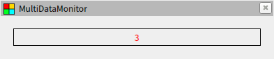
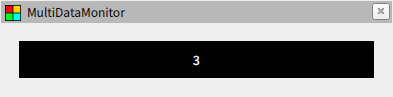
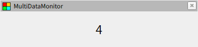

# スタイルシート

## スタイルの指定

スタイルの指定には Qt Style Sheets がそのまま使われています。コンフィグファイルの `stylesheets` は配列になっており、各要素で以下のようにスタイルシートのパスを指定します。特定のウィジェットにのみスタイルを反映したい場合は `target` にウィジェットの名前を記載してください。省略した場合は全てのウィジェットに適用されます。複数の要素で同じウィジェットを指定した場合、ファイルの内容を結合して適用します。

```yaml
{ path: <path>, target: <plugin> }
```

サンプルとして以下のファイルを用意しました。スタイルシートの文法については Qt のドキュメントを参照してください。また、対象とするウィジェットの構成に合わせてクラスセレクタを使用する場合、各ウィジェットの詳細を参照して使用されている Qt のクラス情報を確認してください。

- [style1.yaml](style1.yaml) / [style1.css](style1.css)

  

- [style2.yaml](style2.yaml) / [style2.css](style2.css)

  

- [style3.yaml](style3.yaml) / [style3.css](style3.css)

  

## 属性セレクター

スタイルシートの記述では以下のように属性セレクターを使用することができます。

```css
* [name="value"] {
  color: red;
}
```
